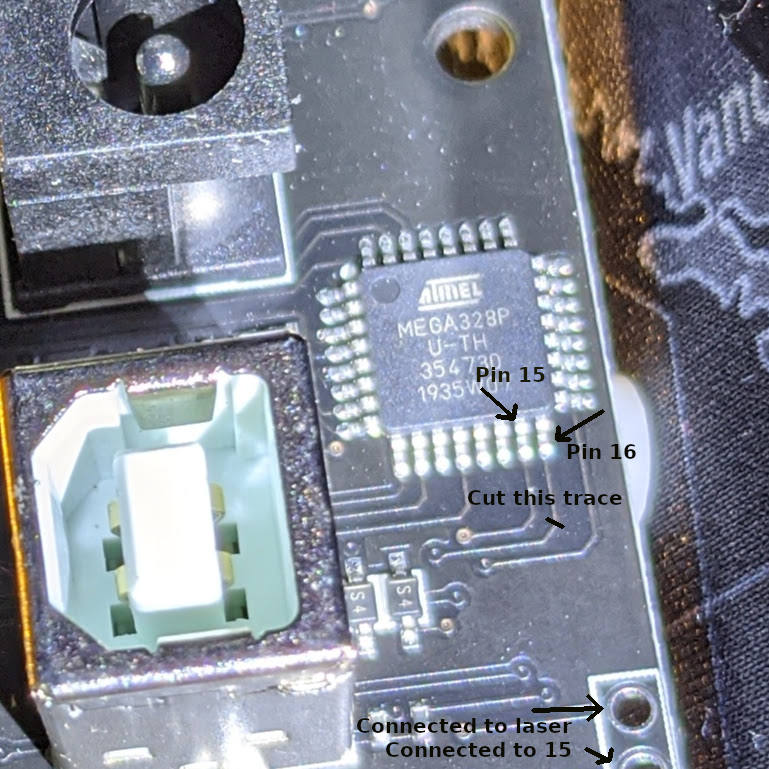

# Upgrade your NEJE Master to GRBL 1.1h

So you bought yourself a laser engraver on Amazon or Aliexpress and thought you
were being smart by choosing one that's
[Grbl](https://github.com/gnea/grbl/)-compatible. But you didn't realize it ran
only ancient Grbl 0.8, which doesn't support the awesome
[Laser Mode](https://github.com/gnea/grbl/wiki/Grbl-v1.1-Laser-Mode) (setting
$32) that makes your engraver perform better. You can upgrade the firmware to
[the latest Grbl version](https://github.com/gnea/grbl/releases), and it still
sort of works, except (1) it won't let you enable Laser Mode, and (2) the laser
doesn't turn on anymore.

This page shows you how to fix this problem and upgrade your NEJE laser engraver
to stock (official build) Grbl v1.1h.

## The problem

Most hardware that supports Grbl on Atmel 328p chips uses the standard pinouts
from the original Arduino CNC shield:

The problem is that the pinout has changed since Grbl 0.9, which swaps D11 and
D12 and relabels the spindle function as "variable spindle PWM":

The reason the Grbl team had to do this was that Laser Mode (which enables more
fine-grained control of the laser strength) needs pulse-width modulation, and
pin D12 on the Arduino happens not to support hardware PWM. But its next-door
neighbor does. Thus the swap.

You're probably here because your Grbl-compatible board was actually designed
for old Grbl, so D12 controls the laser, and a probably nonexistent Z-axis
limiter switch input is connected to D11. (It's probably nonexistent because
most laser engravers move only along the X/Y axes.) This is a hardware problem.
But you can fix it.

## Requirements

* A laser engraver based on the [NEJE](http://nejetool.com) "NEJE Master"
  design.

* An xacto knife.

* A soldering iron and solder (optional depending on how much you care).

* A piece of bare wire, maybe clipped from the leg of a through-hole LED,
  resistor, or capacitor.

* A healthy disregard for your laser engraver's warranty.

## Instructions

1. Remove the board. Unscrew the screws and pull off the cables.

2. Compare to this photo. It should look similar.
   

3. Find the trace leading from the atmega328p's D12 pin (which in AVR land is
   called pin 16). 

4. With your knife, cut the trace leading from pin 16. Use a continuity tester
   to verify that the trace really is broken. An easy way to test is to put one
   probe on pin 16, and the other in the closest empty hole in the header row
   near the 328p.

5. Connect the two empty header holes that are closest to the 328p. I soldered
   part of a diode leg, but you might just choose to thread a wire through the
   two and twist it tightly if you don't have soldering equipment. Connecting
   those two holes is the same as connecting the laser to pin 15 (D11).
   

6. Put the laser engraver back together again. Plug it into your computer.

7. Download
   [the latest .hex from the Grbl releases page](https://github.com/gnea/grbl/releases).

8. Install avrdude (on Ubuntu that's `sudo apt install avrdude`) and flash the .hex:

`avrdude.exe -p m328p -c arduino -p /dev/ttyUSB0 -b 57600 -U flash:w:"grbl_v1.1h.20190825.hex":a`

(Thanks to @TylonHH for providing an example that worked on Windows:
`c:\NEJE\cache\avrdude -u -c arduino -p m328p -P COM10 -b 58000 -U flash:w:"C:\TEMP\avrdude-v8.0-windows-x64\grbl_v1.1h.20190825.hex":a`)

9. Fire up your favorite laser-engraver application, make sure Laser Mode ($32)
   is enabled, and watch your laser engraver move and cut more precisely than
   ever before!

Note that I ended up setting $100/$101 (X/Y steps per mm) to 40 to get the scale
of the cuts to match what I drew in my application. Yours might be different.

If you ever want to go back, remove the jumper, fix the broken trace, and flash
the .hex included in the .rar download link at the bottom of
[the NEJE page](http://wiki.nejetool.com/doku.php?id=nejelaser_master).
